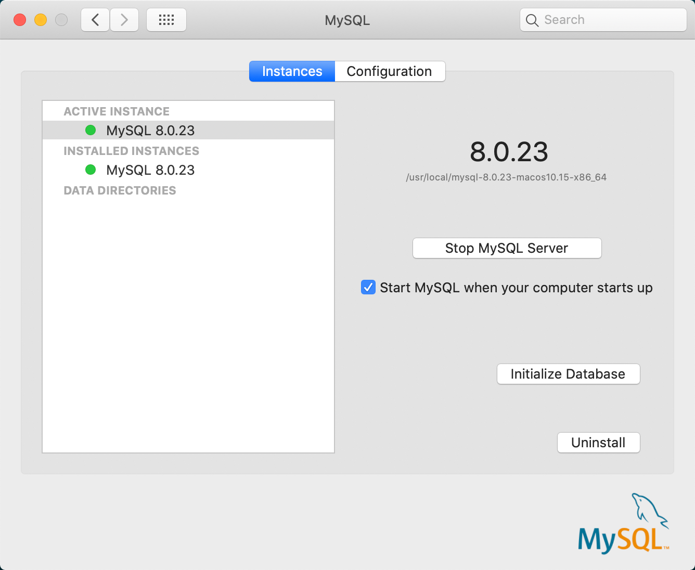
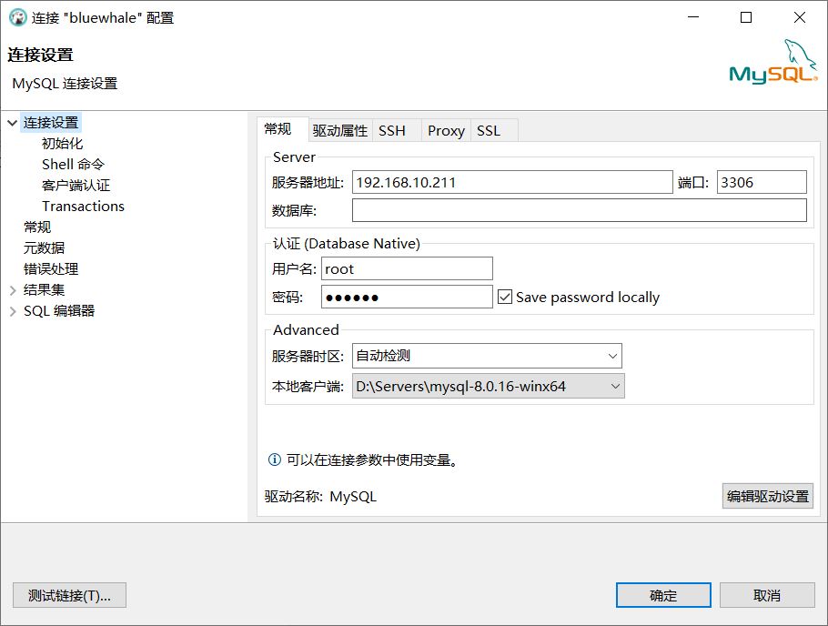
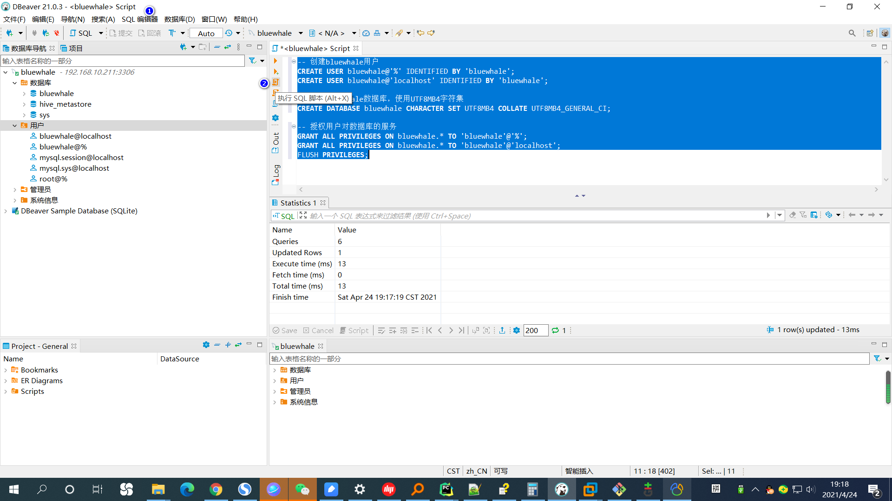
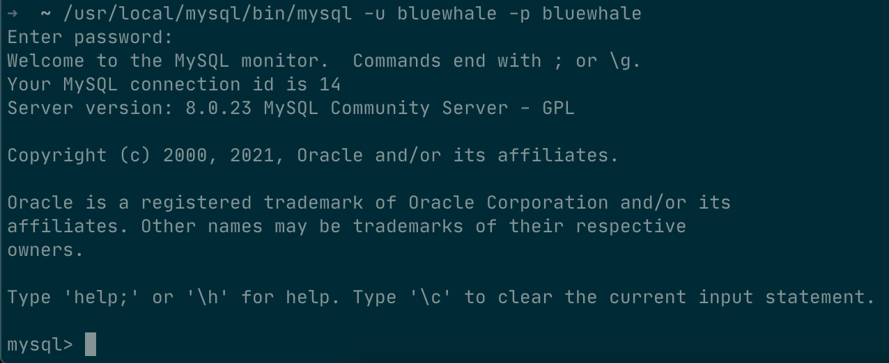
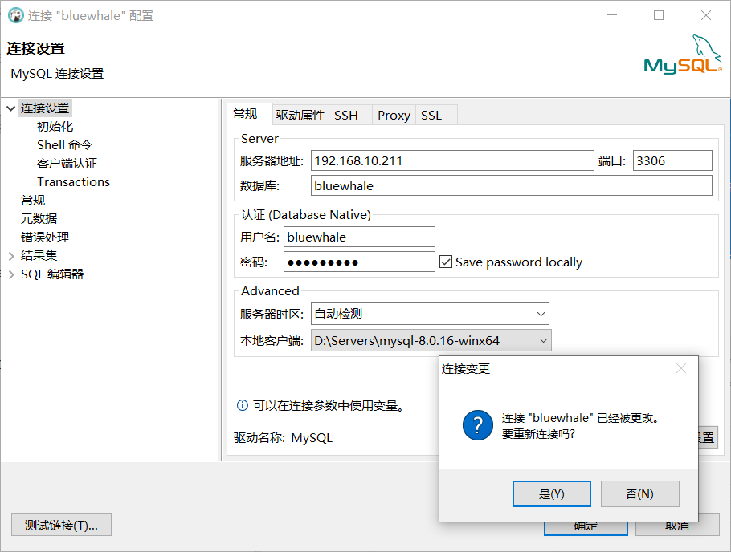
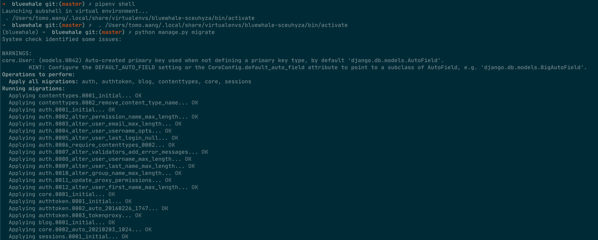
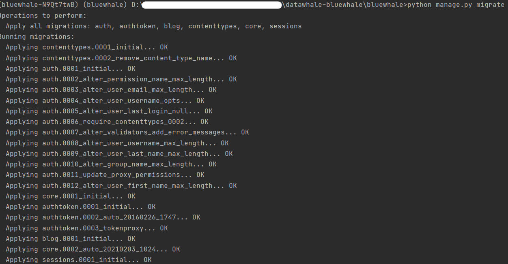
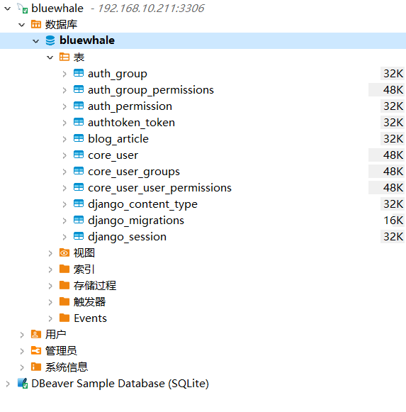
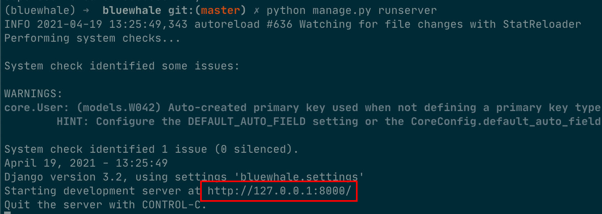
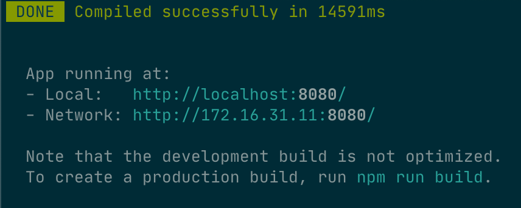

本期任务将简介在课程中涉及的各概念、工具及框架。最终通过[环境搭建](#环境搭建)您将能搭建基础的用于开发的环境
并成功运行示例代码（本期任务假设你已了解数据库、Python、HTTP、HTML、CSS、JavaScript、git等知识）。

# REST简介

REST全称为 **REpresentational State Transfer**，翻译为表述性状态传递。
REST并不是一个框架，而是一种前后端交互的规范或约定。使用REST风格的系统称为RESTful系统，
RESTful系统简化了前后端的通信，且有无状态（stateless）及前后端分离等特性。

REST最早由Roy Fielding在其博士论文Architectural Styles and the Design of Network-based Software Architectures
中定义，

## 前后端分离

在RESTful系统中，通过约定RESTful API，前后端可以做到独立开发，并且可以在保证接口不变的情况下任意替换前后端
的实现语言，比如一套服务端接口可以提供给Web、小程序、Android/iOS客户端同时使用，
或者服务端实现也可以换用不同的框架甚至语言。

一般RESTful系统有静态的前端资源和服务器，部署上会单独部署前端服务（Nginx或CDN），使用反向代理将前端请求转发给后端服务，
由于无状态的特性，后端服务可以横向扩展，在流量高峰期可以通过扩容后端服务器以服务更多的请求。

## 前后端交互

在RESTful系统中，客户端（一般指浏览器）通过发送HTTP请求来获取或更改资源，服务端响应相关请求并返回结果数据。

一个HTTP请求包括以下几个方面：

* HTTP method，用来标识对资源的操作
  - GET - 获取单个资源或一批资源
  - POST - 创建新的资源
  - PUT - 更新资源
  - DELETE - 删除资源
* HTTP header，用来传递额外的信息，如
  - `accept: application/json` 接受的数据类型
  - `x-csrftoken` CSRF头
* Path，用来标识需要操作的资源，如
  - http://example.com/customers/1234 - 表示ID为1234的用户
  - http://example.com/customers/1234/orders - 表示ID为1234的用户订单

一个相应的HTTP响应包括如下几个方面：

* Content-Type: 返回的数据类型，如`application/json`
* Status Code: HTTP状态码，常用的状态码如下：
  - 200 - 成功
  - 201 - 成功创建了新资源
  - 204 - 成功，无返回体
  - 400 - 客户端请求错误
  - 401 - 未认证
  - 403 - 未授权
  - 404 - 未找到对应的资源
  - 405 - 不允许的HTTP method
  - 50x - 服务端错误
* Response Body：返回的数据，如JSON文本

# OpenAPI简介

OpenAPI Specification(OAS)定义了一个标准的、语言无关的RESTful接口规范。使用接口规范能够使开发人员
在不知道具体实现的情况下了解相关服务提供的功能，同时允许程序依据接口规范进行模拟（mock）并与之交互。
在前后端基于接口规范达成一致意见后，可以基于规范做并行开发，在功能完成后进行集成测试与部署发布，提高了
前后端开发效率。

## OpenAPI接口规范

一个OpenAPI接口规范由一份或多份文档组成，文档内容为`JSON`对象，可以由`JSON`或`YAML`文件格式进行书写。
当使用多份文档时，使用[`JSON Schema`](https://json-schema.org/)定义的`$ref`进行关联，且一般使用
`openapi.json`或者`openapi.yaml`作为根文件。

以最新的`3.0.3`为例，一个接口规范文档由下面几个根字段组成：

* `openapi` - 必选，标识文档所用的OpenAPI规范版本号，如`3.0.3`
* `info` - 必选，文档相关元信息，如名称、描述、版权、版本等
* `servers` - 描述连接服务器相关信息
* `paths` - 必选，核心的关于接口的路径及可用操作的描述
* `components` - 描述各组件的`JSON Schema`规范并可被引用
* `security` - 描述访问API所需的安全机制，如认证方式等
* `tags` - 其他标签信息，作为元信息的补充
* `externalDocs` - 额外引用的文档

其中在编写API规范文档时主要涉及的是`components`及`paths`部分。具体的规范定义请参考
[官方文档](https://swagger.io/specification/)。

# Django简介

`Django`是一个高度抽象的Python Web框架，最初被设计用于具有快速开发需求的新闻类站点，目的是要实现简单快捷的网站开发。

Django提供了对象关系映射（ORM, Object-Relational Mapping），可以通过Python代码来描述数据库结构。
通过数据模型语句来描述数据模型，并通过`makemigrations`及`migrate`等命令行工具自动生成数据模型迁移脚本并
自动创建数据库表。同时ORM屏蔽了底层数据库，大多数情况下，一套ORM模型可以运行在多种主流的关系型数据库上（如MySQL或PostgreSQL）。

通过定义URL规则及视图映射，Django可以方便的将URL路径与视图进行关联，并将Python代码与URL进行解耦。同时URL中的
宏将会以参数的形式传递给视图函数。

Django还提供模板功能，通过结合Python对象与模板文件，Django可以渲染出静态HTML文件并作为HTTP请求的返回内容。
（在本课程中使用前后端分离理念，未使用模板）

Django提供丰富的接口及扩展功能，拥有完善的社区及众多的三方扩展应用，可以极大简化开发过程，对于中小型项目可以
较大程度简化开发。如本次课程中使用的三方工具[Django Rest Framework](https://github.com/encode/django-rest-framework)
可以方便的基于Django项目生成符合规范的RESTful系统。

# Vue简介

Vue是一套用于构建用户界面的渐进式框架。与其它大型框架不同的是，Vue 被设计为可以自底向上逐层应用。
Vue 的核心库只关注视图层，不仅易于上手，还便于与第三方库或既有项目整合。另一方面，当与现代化的工具链以及各种支持类库结合使用时，
Vue 也完全能够为复杂的单页应用提供驱动。

Vue的核心是使用简洁的模板语法来声明式地将数据渲染进DOM系统，如下所示：

```HTML
<div id="app">
  {{ message }}
</div>
```

```JavaScript
var app = new Vue({
  el: '#app',
  data: {
    message: 'Hello Vue!'
  }
})
```

通过简单的元素绑定，数据`data`与DOM`#app`建立了联系并成为**响应式**的，通过更改`app.message`的值，我们可以实时
看到DOM中内容实时发生了变化。

与传统的JavaScript+HTML的前端开发不同，在Vue编写的应用中我们将不再与HTML直接交互，转而通过方法等控制Vue实例
内部属性，由Vue来处理数据变化带来的渲染变化（Vue在背后做了大量的工作和优化）。

# 环境搭建

组队完成后，由队长创建Github新的组织并将团队成员加至组织，然后将代码fork至组织仓库。
团队成员clone fork后的仓库，如（请替换自己的组织名称）：

`git clone git@github.com:whale-web-team00/whale-web.git`

## 数据库

本课程将使用[MySQL](https://www.mysql.com/)作为数据库

### 安装数据库

（如果你系统中已安装MySQL数据库，可跳过该步骤）

* Mac (图形界面)
  - 从官网下载DMG安装包[https://dev.mysql.com/downloads/mysql/](https://dev.mysql.com/downloads/mysql/)
  - 双击并按提示安装
  - 安装完成后，在系统设置最后能够找到MySQL的服务，如下所示


* Windows:
  - 从官网下载MySQL Install for Windows安装包[https://dev.mysql.com/downloads/mysql/](https://dev.mysql.com/downloads/mysql/)
  - 双击并按提示安装
  - 下载数据库连接客户端[DBeaver](https://dbeaver.io/download/)
### 初始化数据库

通过root用户连接数据库`/usr/local/mysql/bin/mysql -u root -p`，在SQL终端，运行下列SQL语句：
#### windows 下可以用 DBeaver 连接 mysql

```sql
-- 创建bluewhale用户
CREATE USER bluewhale@'%' IDENTIFIED BY 'bluewhale';
CREATE USER bluewhale@'localhost' IDENTIFIED BY 'bluewhale';

-- 创建bluewhale数据库，使用UTF8MB4字符集
CREATE DATABASE bluewhale CHARACTER SET UTF8MB4 COLLATE UTF8MB4_GENERAL_CI;

-- 授权用户对数据库的服务
GRANT ALL PRIVILEGES ON bluewhale.* TO 'bluewhale'@'%';
GRANT ALL PRIVILEGES ON bluewhale.* TO 'bluewhale'@'localhost';
FLUSH PRIVILEGES;
```
#### 也可打开 DBeaver 的sql编辑器执上面的sql脚本


断开连接后，使用新用户连接新数据库`/usr/local/mysql/bin/mysql -u bluewhale -p bluewhale`，你将看到连接成功的信息：

#### 如果用 DBeaver 可以编辑连接信息,通过 bluewhale 用户的连接 bluewhale 数据库:


## 后端服务

本课程使用Python作为后端开发语言，使用Django作为后端框架，使用[pipenv](https://github.com/pypa/pipenv)
作为Python的依赖管理工具。

* 安装Python3.8：如已有Python3.8环境，可跳过此步骤
* 安装pipenv: `pip install pipenv`
* 安装Python依赖包：
  - 进入clone下来的项目目录，进入子目录: `cd bluewhale`
  - 同步依赖包: `pipenv sync`
  
    windows cmd命令行执行同步效果：
  
* 初始化数据表并创建初始用户：
  - 激活virtualenv: `pipenv shell` (如果已经在conda或其他virtualenv环境中，需要先deactivate)
  - 初始化数据表：`python manage.py migrate`


    windows cmd命令行初始化数据表效果：
    
    使用 DBeaver 可以看到新增的数据表: 
    
  - 初始化超级管理员用户：`python manage.py createsuperuser`
* 启动后端服务：`python manage.py runserver`

成功后你将看到如下信息：



表明后端服务已经启动并监听`127.0.0.1:8000`端口。

## 前端

本课程使用ES6作为前端开发语言，Vue作为前端开发库，使用基于Node.js的构建工具进行项目的构建与编译。

* 安装Node.js 版本14.15 [https://nodejs.org/en/download/](https://nodejs.org/en/download/)。
如已安装其他版本Node.js，可以使用[nvm](https://github.com/nvm-sh/nvm)进行多版本管理
* 安装前端依赖包：
  - 进入clone下来的项目目录，进入子目录：`cd client`
  - 同步依赖包：`npm install`
* 启动前端：`npm run serve`

在运行`npm run serve`命令后，前端会开始编译，成功后将展示如下信息：



表明前端编译完成，开启了调试模式，并监听在`127.0.0.1:8080`端口。在浏览器中打开该地址将能看到如下界面：


> npm install 失败 可以更新 node
# 参考资料

 * [https://www.ics.uci.edu/~fielding/pubs/dissertation/rest_arch_style.htm](https://www.ics.uci.edu/~fielding/pubs/dissertation/rest_arch_style.htm)
 * [https://www.codecademy.com/articles/what-is-rest](https://www.codecademy.com/articles/what-is-rest)
 * [https://swagger.io/specification/](https://swagger.io/specification/)
 * [https://docs.djangoproject.com/en/3.2/](https://docs.djangoproject.com/en/3.2/)
 * [https://djangopackages.org/](https://djangopackages.org/)
 * [Django Rest Framework](https://github.com/encode/django-rest-framework)
 * [https://vuejs.org/v2/guide/](https://vuejs.org/v2/guide/)
